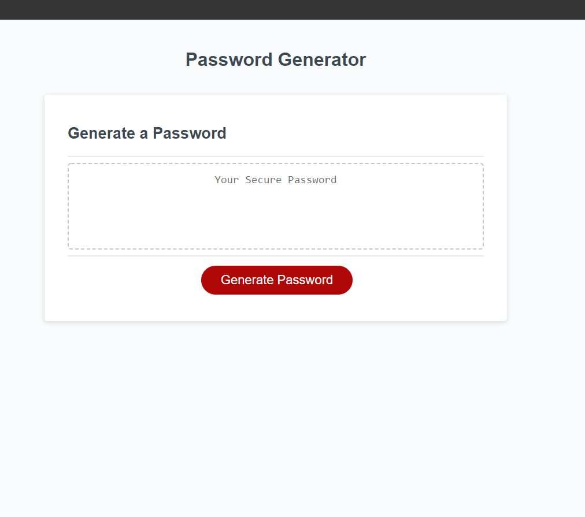
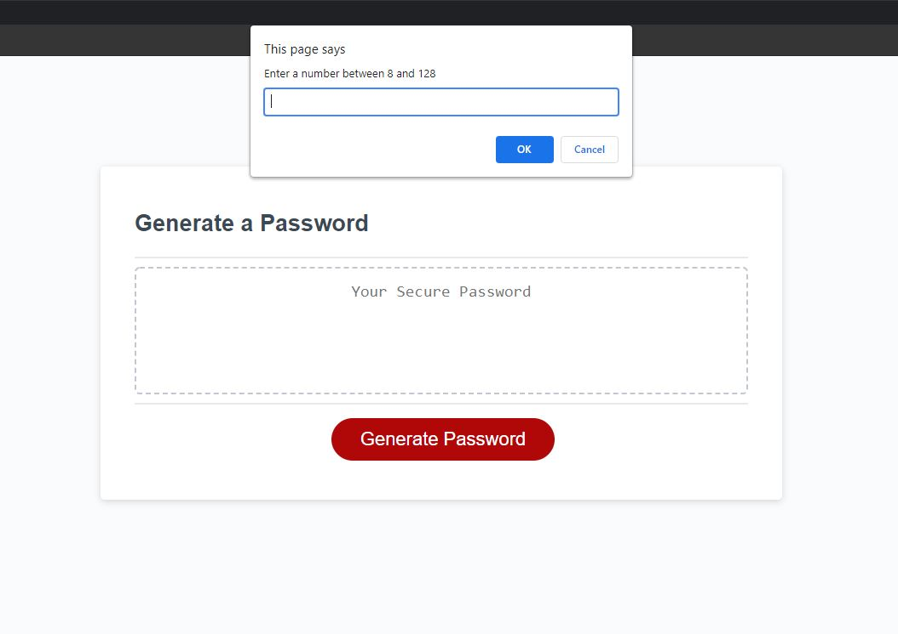
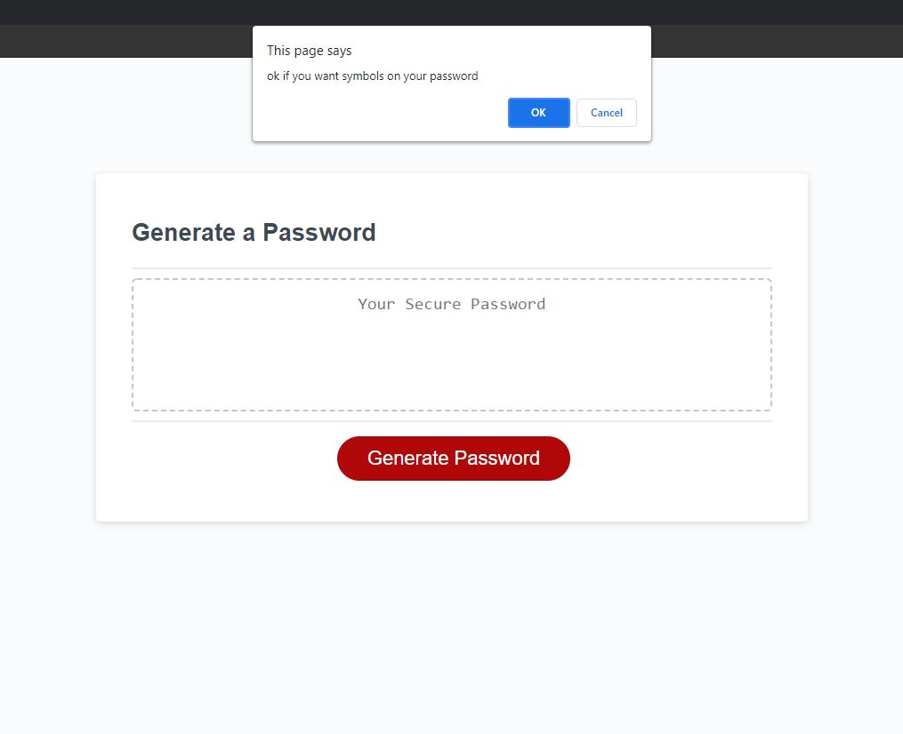
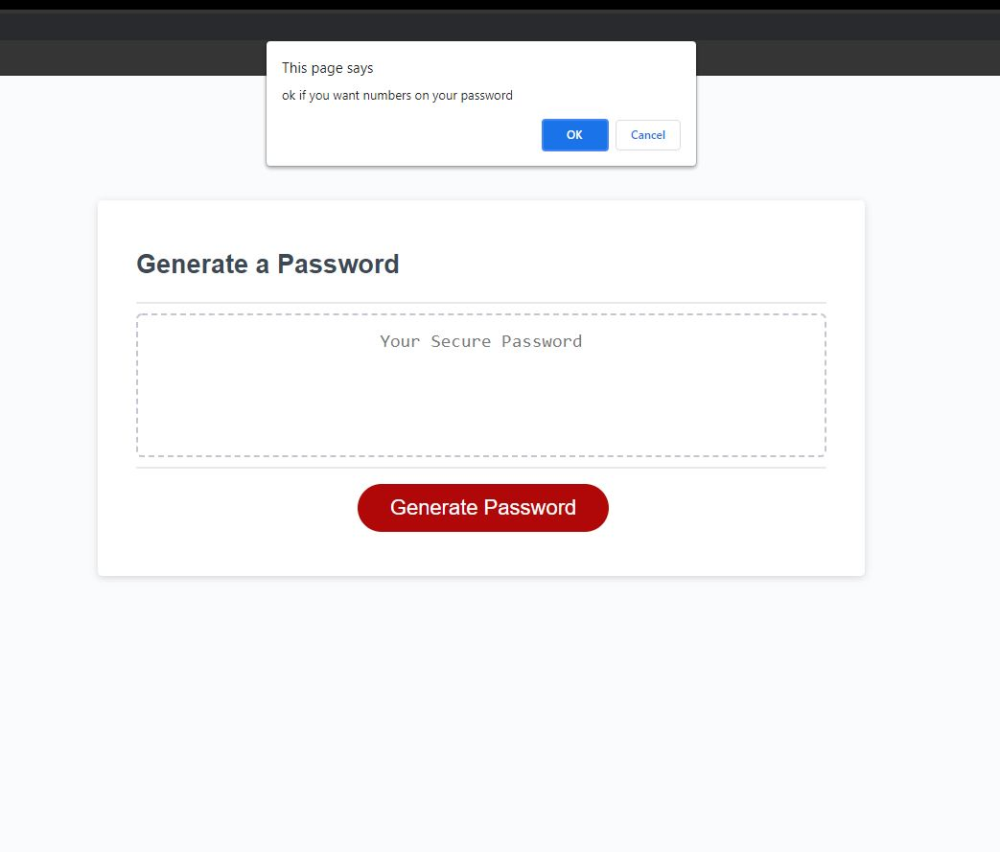
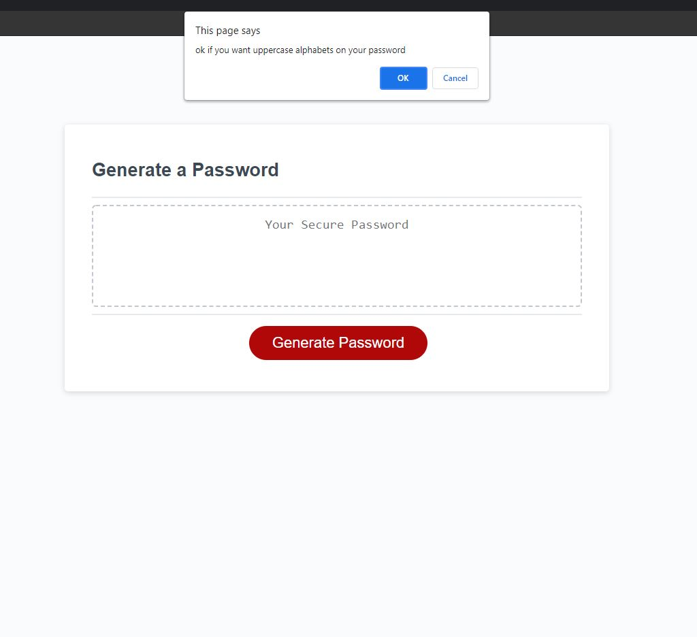
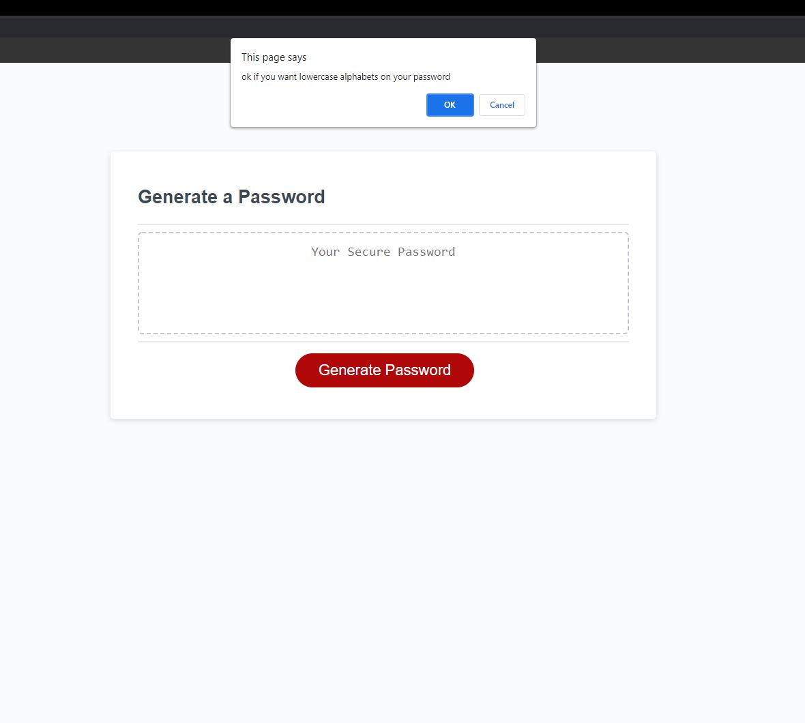
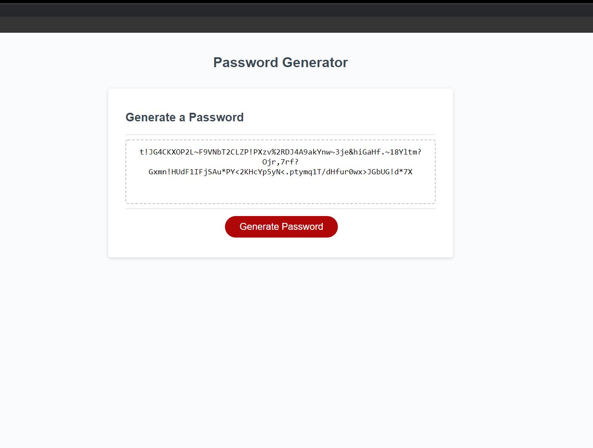

# Task-3-passwordGenerator
## Application description
This application is powered with HTML, CSS and JAVASCRIPT.
User can generate random passwords between 0-128 charater which includes random(numbers,symbols letters).
In order to generate strong random password user are prompt to select the disired characters to be included on their password.
## Application-in a glance

### Application home screen

### when user click generate application prompt to ask to enter length of your password

### application prompt to ask do you want to include symbols(ok or cancel).

### application prompt to ask do you want to include numbers(ok or cancel).

### application prompt to ask do you want to include uppercase alphabets(ok or cancel).

### application prompt to ask do you want to include lowercase alphabets(ok or cancel).

### application now generate user password as per user selections.

##Usage
This application will help user to create a strong random password.

### credits and acknowledgement 
https://www.youtube.com/channel/UCFbNIlppjAuEX4znoulh0Cw
https://stackoverflow.com/questions/1497481/javascript-password-generator
https://www.geeksforgeeks.org/how-to-generate-a-random-password-using-javascript/
https://www.theamplituhedron.com/projects/JavaScript-Random-Password-Generator/
